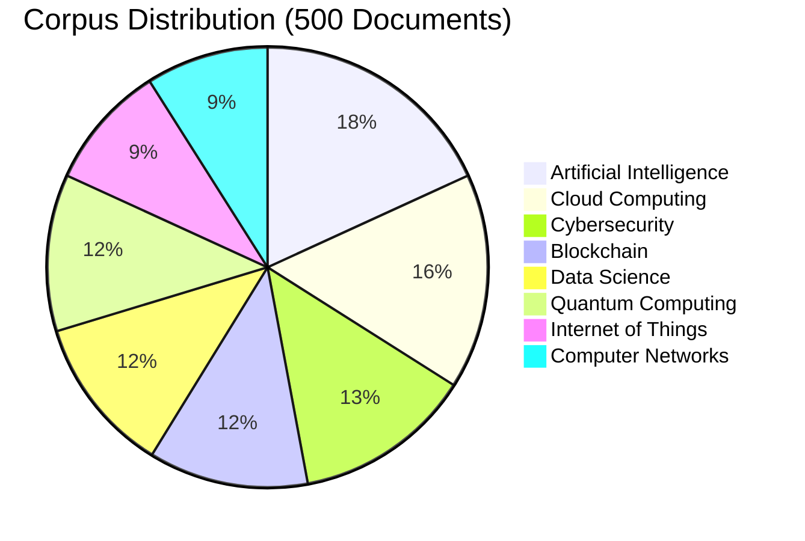
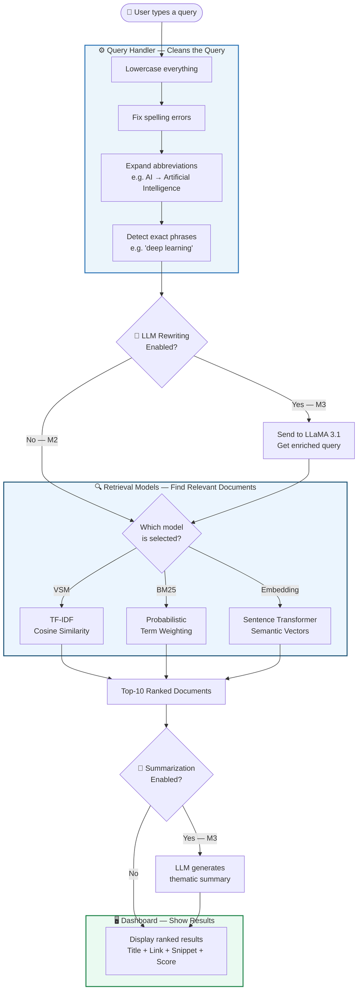
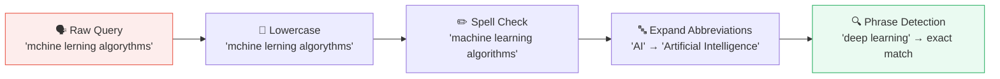
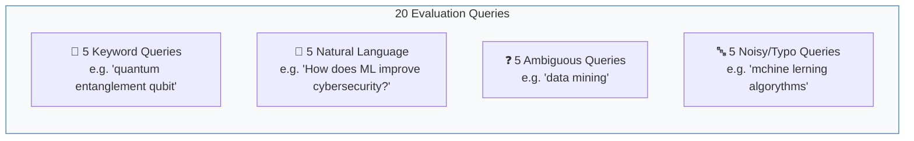
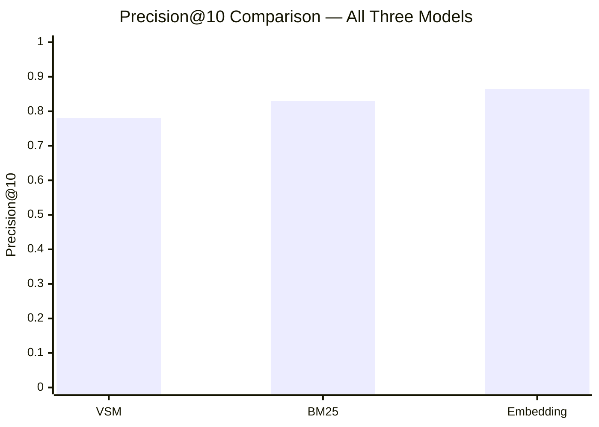
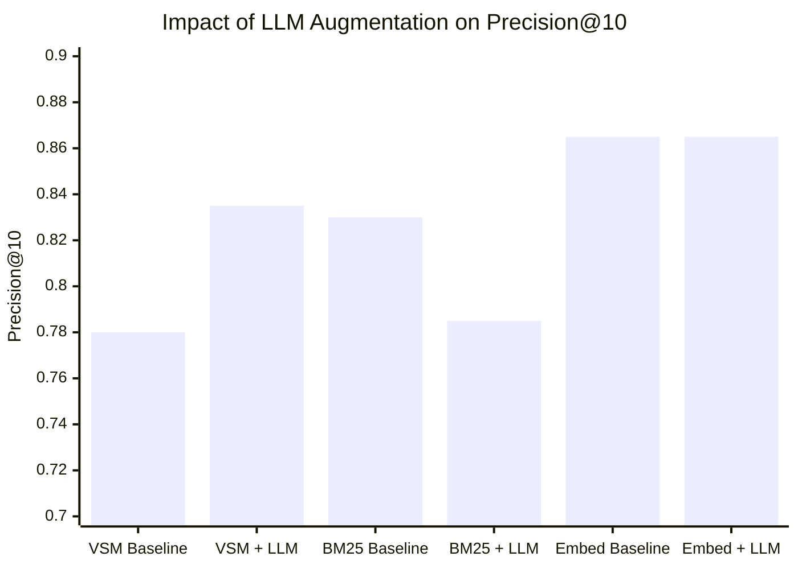
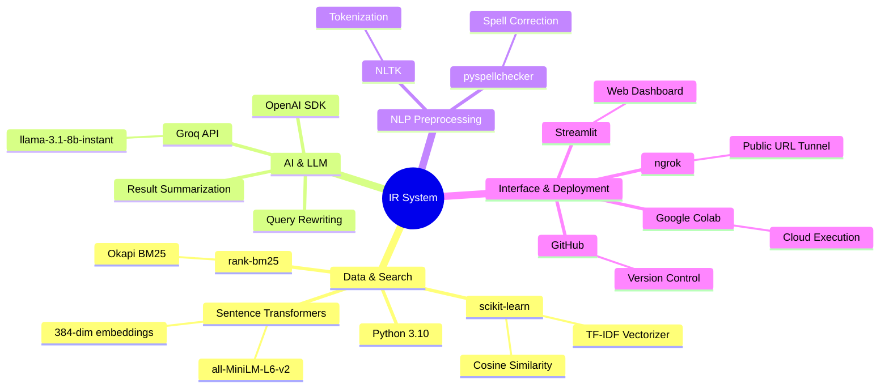

<div align="center">

# 🔍 Intelligent Information Retrieval System

### *From raw documents to AI-augmented search — built from scratch*

[](https://python.org)
[](https://streamlit.io)
[](https://groq.com)
[](.)

<br/>

> **Built a search engine from the ground up** — corpus collection, three retrieval algorithms, a live web dashboard, and finally integrated an AI language model to make search smarter. Evaluated everything with scientific metrics across 500 documents and 20 test queries.

<br/>

---

</div>

## 📖 What Is This Project?

Imagine you have **500 technical articles** on topics like Artificial Intelligence, Blockchain, Cybersecurity, and Quantum Computing — all mixed together. Now imagine someone types a search query. How do you find the most relevant articles?

That's exactly what this project solves. We built a complete **Information Retrieval (IR) system** — the same technology that powers Google, academic search engines, and document databases — but built from scratch and evaluated scientifically.

The project went through **three milestones**, each adding a more sophisticated layer:

| Milestone | What We Built | Status |
|-----------|--------------|--------|
| 📚 M1 — Corpus | Collected & organized 500 documents across 8 topics | ✅ Complete |
| 🔎 M2 — Retrieval Engine | Built 3 search algorithms + live dashboard | ✅ Complete |
| 🤖 M3 — AI Augmentation | Integrated LLM to rewrite queries & summarize results | ✅ Complete |

<br/>

---

## 📂 The Dataset — 500 Documents, 8 Topics

We collected **500 real technical documents** covering the most important areas of modern computing:



Every document has four fields: a **title**, the **full text content**, its **topic category**, and a **source URL** — making it ready for search and evaluation.

<br/>

---

## 🏗️ System Architecture — How It All Works

Here is the full pipeline from the moment a user types a query to the moment results appear on screen:



<br/>

---

## 🔎 Milestone 2 — The Three Search Algorithms

We implemented and compared three fundamentally different approaches to search. Think of them as three different ways of answering the question: *"How similar is this document to what the user is looking for?"*

<br/>

### 🅰️ Vector Space Model (VSM)
> *"Convert everything into numbers and measure the angle between them"*

Every document and every query gets turned into a list of numbers (a vector), where each number represents how important a word is in that text. We then measure the **angle** between the query vector and each document vector. A small angle = high similarity = relevant document.

- **Strength:** Fast, simple, interpretable
- **Weakness:** Needs exact word matches — can't understand synonyms

<br/>

### 🅱️ BM25 (Best Match 25)
> *"Words that appear rarely are more meaningful than words that appear everywhere"*

BM25 is the industry standard for text search (used in Elasticsearch, Solr, and many search engines). It improves on VSM by accounting for: how often a word appears in a document, how long the document is, and how rare the word is across the entire corpus.

- **Strength:** Handles different document lengths fairly; generally higher precision than VSM
- **Weakness:** Still based on exact words — can't handle meaning

<br/>

### 🅲 Embedding-Based Retrieval (Semantic Search)
> *"Understand the meaning, not just the words"*

This model uses a pre-trained AI (Sentence Transformers) to convert text into 384-dimensional **meaning vectors**. Two sentences that mean the same thing but use different words will have very similar vectors. This enables true **semantic search** — finding documents that are conceptually related to a query, even if they share no words.

- **Strength:** Handles synonyms, paraphrases, natural language questions
- **Weakness:** More computationally expensive; can over-generalize on abstract queries

<br/>

---

## 🧠 Milestone 2 — Smart Query Handling

Before any query reaches the search algorithm, it passes through four preprocessing steps:



| Feature | Example |
|---------|---------|
| **Spell Correction** | `mchine lerning` → `machine learning` |
| **Abbreviation Expansion** | `IoT` → `Internet of Things`, `AI` → `Artificial Intelligence` |
| **Case Insensitivity** | `BLOCKCHAIN`, `Blockchain`, `blockchain` → same results |
| **Phrase Matching** | `"neural network"` → ranks exact phrase matches higher |

<br/>

---

## 📊 Milestone 2 — Evaluation Results

We designed **20 evaluation queries** of four types to stress-test every aspect of the system:



Results measured using three scientific metrics:
- **Precision@10** — Of the top 10 results returned, what fraction were actually relevant? *(higher is better)*
- **Recall** — Of all relevant documents in the corpus, what fraction did we find? *(higher is better)*
- **MAP** — Mean Average Precision, a combined measure of ranking quality *(higher is better)*



| Model | Precision@10 | Recall | MAP | Rank |
|-------|:---:|:---:|:---:|:---:|
| 🥉 Vector Space Model (VSM) | 0.780 | 0.0812 | 0.0694 | 3rd |
| 🥈 BM25 | 0.830 | 0.0895 | 0.0826 | 2nd |
| 🥇 Embedding-based | **0.865** | **0.0935** | **0.0892** | **1st** |

> **Reading this:** The Embedding model returned relevant documents in 86.5% of its top-10 results on average. Out of every 10 search results it showed, almost 9 were genuinely on topic.

<br/>

---

## 🤖 Milestone 3 — Making Search Smarter with AI

In the final milestone, we integrated a **Large Language Model (LLaMA 3.1, via Groq API)** into the pipeline. We implemented two strategies:

<br/>

### Strategy 1 — Query Rewriting
Before the query reaches the search engine, the LLM rewrites it to be more precise and technically rich:

```
User types:   "How does ML improve cybersecurity threat detection?"
                              ↓  LLM rewrites it
Search uses:  "machine learning cybersecurity intrusion detection
               threat classification anomaly detection neural networks"
```

The rewritten version contains technical vocabulary that actually appears in the relevant documents — dramatically improving match quality.

<br/>

### Strategy 2 — Result Summarization
After retrieval, the LLM reads the top 5 documents and generates a **plain-English summary** of what the results cover:

```
🔎 Query: "network security"

📝 AI Summary: The retrieved documents cover firewall configuration,
intrusion detection systems, and DDoS mitigation strategies. Several
results address ML-based anomaly detection in network traffic.
Blockchain-based security frameworks are also represented.

🏷️ Themes: Intrusion Detection · Encryption · DDoS Mitigation · Anomaly Detection
```

<br/>

### Milestone 3 — Evaluation Results

The LLM augmentation produced a **surprising and instructive finding**:

| Model | Baseline P@10 | With LLM | Change | Why |
|-------|:---:|:---:|:---:|---|
| VSM | 0.780 | **0.835** | 🟢 +0.055 | LLM vocabulary bridging moved the query vector toward relevant documents |
| BM25 | 0.830 | **0.785** | 🔴 −0.045 | Extra terms introduced cross-topic noise in BM25's additive scoring |
| Embedding | 0.865 | **0.865** | ⚪ 0.000 | Semantic encoding already provides the coverage LLM expansion offers |



> **The key insight:** The same LLM rewrites improved VSM but hurt BM25. This is because VSM uses normalized cosine similarity (adding terms helps), while BM25 uses an additive scoring model (adding cross-topic terms introduces ranking noise). This finding reveals a fundamental architectural difference between the two models.

<br/>

---

## 🖥️ The Live Dashboard

The system runs as a **web application** built with Streamlit. Here is what a user sees:

```
┌─────────────────────────────────────────────────────────────────┐
│  🔍 Information Retrieval System — Milestone 3                  │
│  500 documents · 8 topics · 3 retrieval models                  │
├──────────────────┬──────────────────────────────────────────────┤
│  ⚙️ Settings     │  🔎 Search Query                             │
│                  │  ┌──────────────────────────────────────┐    │
│  Model:          │  │  quantum computing applications      │    │
│  ● BM25          │  └──────────────────────────────────────┘    │
│  ○ VSM           │                                              │
│  ○ Embedding     │  🔧 Query Processing                         │
│                  │  Original → quantum computing applications    │
│  Results: [10]   │  Expanded → quantum computing applications   │
│                  │                                              │
│  🤖 LLM          │  ✏️ LLM Rewrote to:                          │
│  ✅ Query Rewrite │  "quantum computing qubits gate operations   │
│  ✅ Summarize     │   quantum algorithms applications industry"  │
│                  ├──────────────────────────────────────────────┤
│  🔑 API Key      │  📝 AI Summary                               │
│  ●●●●●●●●●●      │  The results cover quantum gate operations,  │
│                  │  cryptography applications, and quantum       │
│  📊 Topics       │  machine learning. IBM and Google quantum     │
│  AI:          93 │  hardware is frequently referenced...        │
│  Cloud:       81 │                                              │
│  Security:    67 │  Themes: `Quantum Gates` `Cryptography` `ML` │
│  Blockchain:  60 │──────────────────────────────────────────────│
│  Data Sci:    59 │  📋 Top 10 Results  (0.043s)                 │
│  Quantum:     59 │                                              │
│  IoT:         47 │  #1 [Quantum Computing in Drug Discovery]    │
│  Networks:    46 │      📁 Quantum Computing  ·  Score: 0.8821  │
│                  │      Quantum computers offer exponential...  │
└──────────────────┴──────────────────────────────────────────────┘
```

<br/>

---

## 🧪 Failure Case Analysis

A key part of scientific evaluation is understanding *where and why* systems fail. We identified one failure case per model:

| Model | Failure Query | What Went Wrong |
|-------|--------------|----------------|
| **VSM** | `"the art of concealing information within digital content"` | VSM needs exact words. Cybersecurity documents use "steganography", "encryption" — not "concealing" or "art". Zero overlap = zero score. |
| **BM25** | `"token based access control"` | "Token" appears heavily in Blockchain (cryptocurrency tokens). BM25 returned Blockchain documents instead of Cybersecurity ones. |
| **Embedding** | `"nodes detecting suspicious activity in the network"` | "Nodes" strongly activates both Computer Networks AND Blockchain. Query embedding landed equidistant from both, diluting results. |

<br/>

---

## 🛠️ Technologies Used



<br/>

---

## 🚀 How to Run This Project

**Option A — Google Colab (Recommended, no setup needed)**

1. Open [Google Colab](https://colab.research.google.com)
2. Clone this repository into your Drive:
```python
from google.colab import drive
drive.mount('/content/drive')

import os
os.makedirs('/content/drive/MyDrive/ir_project', exist_ok=True)
%cd /content/drive/MyDrive/ir_project

!git clone https://github.com/YOUR_USERNAME/information-retrieval-project.git .
```
3. Run the cells in order from the notebook, or follow the cell-by-cell guide in `SETUP.md`

**Option B — Local Machine**
```bash
# 1. Clone the repo
git clone https://github.com/YOUR_USERNAME/information-retrieval-project.git
cd information-retrieval-project

# 2. Install dependencies
pip install -r requirements.txt

# 3. Set your API key (get a free one at console.groq.com)
export LLM_API_KEY="your_groq_api_key_here"

# 4. Launch the dashboard
streamlit run app.py
```

> **Note:** The first run will download the Sentence Transformer model (~90MB) and compute document embeddings (~2–4 minutes). After that, everything loads from cache instantly.

<br/>

---

## 📁 Repository Structure

```
📦 information-retrieval-project/
│
├── 📂 corpus/
│   └── corpus.json              ← 500 documents, 8 topics
│
├── 📂 models/
│   ├── __init__.py
│   ├── vsm.py                   ← TF-IDF + Cosine Similarity
│   ├── bm25.py                  ← Okapi BM25
│   └── embedding.py             ← Sentence Transformers
│
├── corpus_loader.py             ← Loads & normalizes the corpus
├── query_handler.py             ← Spell check, abbreviations, phrases
├── llm_augment.py               ← LLM Query Rewriting + Summarization
├── evaluator.py                 ← Precision@10, Recall, MAP
├── queries.py                   ← 20 evaluation queries
│
├── app.py                       ← Streamlit web dashboard
├── run_evaluation.py            ← Milestone 2 evaluation script
├── run_evaluation_m3.py         ← Milestone 3 evaluation script
│
├── evaluation_results.csv       ← M2 results (all 3 models × 3 metrics)
├── evaluation_m3_results.csv    ← M3 results (baseline vs LLM-augmented)
├── rewrite_log.csv              ← All 20 queries: original vs rewritten
│
├── requirements.txt             ← Python dependencies
└── README.md                    ← This file
```

<br/>

---

## 📈 Key Achievements Summary

```
┌───────────────────────────────────────────────────────────────────────┐
│                    PROJECT ACHIEVEMENTS AT A GLANCE                    │
├───────────────────────────────────────────────────────────────────────┤
│                                                                        │
│  📚  500 documents collected and organized across 8 technical topics  │
│                                                                        │
│  🔍  3 search algorithms built from scratch and compared              │
│       Best model: 86.5% precision on top-10 results                   │
│                                                                        │
│  🧪  20 evaluation queries × 3 models = 60 precision measurements    │
│                                                                        │
│  🤖  LLM integration revealed a counter-intuitive finding:            │
│       Same rewrites improved VSM (+5.5%) but hurt BM25 (-4.5%)       │
│       — proving deep understanding of each model's architecture       │
│                                                                        │
│  🖥️  Full web dashboard deployed and demo-ready                       │
│                                                                        │
│  ⚡  Sub-50ms query response time for VSM and BM25                    │
│                                                                        │
└───────────────────────────────────────────────────────────────────────┘
```

<br/>

---

## 📚 What We Learned

This project covered core concepts from the field of **Information Retrieval**, a discipline that underpins every search engine, recommendation system, and document database in the world:

- **Why exact-word search has limits** — and why semantic search exists
- **The vocabulary mismatch problem** — a document about "heart attacks" won't match a query about "myocardial infarctions" without semantic understanding
- **Why BM25 is the industry standard** — and when it outperforms more complex approaches
- **When AI augmentation helps vs. hurts** — not all improvements are universal; model architecture determines how well a system absorbs enhancements
- **Scientific evaluation of IR systems** — Precision, Recall, and MAP as the standard measurement framework

<br/>

---

<div align="center">

**Built as part of an Information Retrieval course project**

*Data Science & Artificial Intelligence Program*

---

*If you found this project interesting, feel free to ⭐ star the repository!*

</div>
